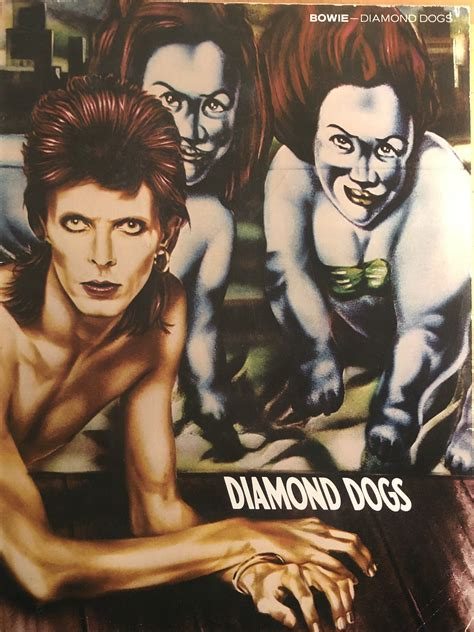

This ain't rock and roll, this is genocide

As they pulled you out of the oxygen tent

You asked for the latest party

With your silicone hump and your ten inch stump

Dressed like a priest you was

Tod Browning's Freak you was

Crawling down the alley on your hands and knee

I'm sure you're not protected, for it's plain to see

The Diamond Dogs are poachers and they hide behind trees

Hunt you to the ground they will, mannequins with kill appeal

(Will they come?) I'll keep a friend serene

(Will they come?) Oh baby, come on to me

(Will they come?) Well, she's come, been and gone

Come out of the garden, baby

You'll catch your death in the fog

Young girl, they call them the Diamond Dogs

Young girl, they call them the Diamond Dogs
