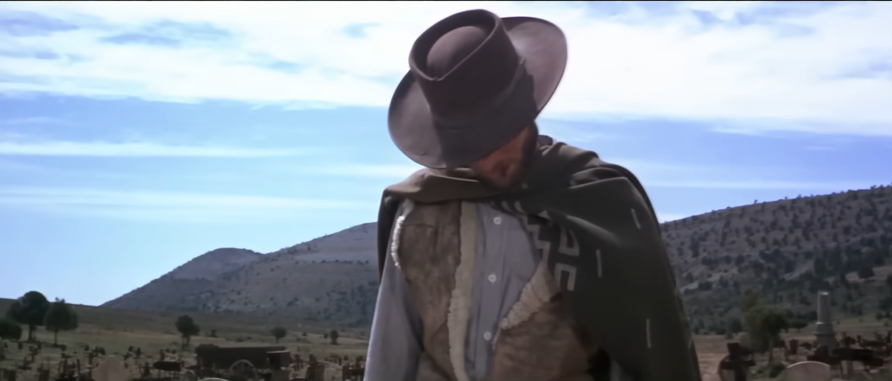
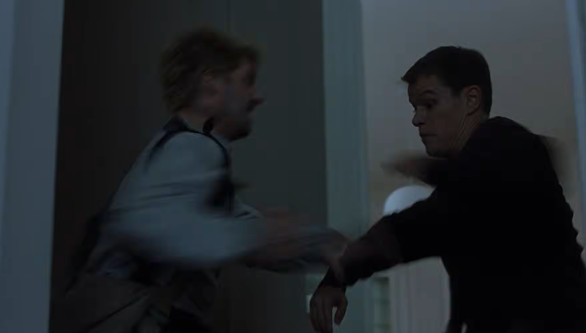
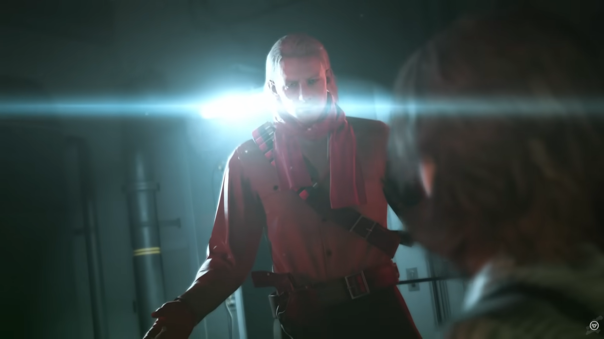
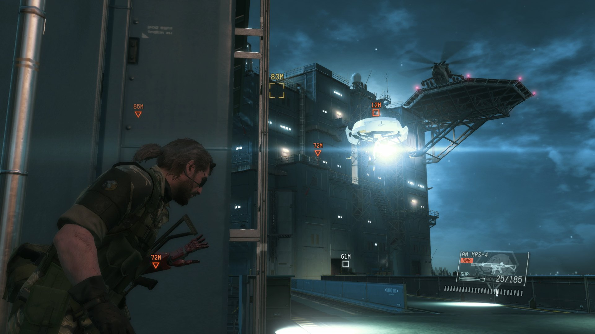

Camerawork is an important aspect of any visual media. From video games, to movies, to TV series, and in a way, even books, the camera provides a window into the fictional setting. After having consumed a considerable amount of media, I have gained much appreciation for the camerawork of Metal Gear Solid V: The Phantom Pain in particular. But in order to express my appreciation effectively, I must go over some of the things I have noticed about cameras in media. 

## The Styles of Camerawork I have noticed:

### 1. The 'Steady' Camera:

Examples of this kind of camerawork would be The Matrix trilogy and old kung-fu movies (generally any pre-2000s movie, really.) Although these entries have fast moving cameras when needed, such as a pan from the hero to the villain, or for dramatic moments where the camera zooms in, or zooms out, or my personal favorite, does a dolly zoom, these movies generally have stable cameras where the subject of the shot and the subject's actions can be clearly made out. They have a general clarity which is needed to show the viewer all the actions occurring in the scene. 
### 2. The 'Shaky' Camera:

The 'shaky' camera was first made popular in films of the 'found footage' genre and then the Bourne movie series. It is characterized by a 'shaky' effect that is brought on due to the scene being shot with a handheld camera. Footsteps of the cameraman shake the camera, in contrast to the camera rig keeping the camera steady. This type of camerawork works in favor of the Bourne series and movies of the 'found footage' genre due to making the feeling and vibe of the scene much more up close and personal compared to a 'steady' camera. It is also used cleverly in a few places, allowing the creator to obscure the nature of certain actions to make them more cool than what they would look like on a 'steady' camera. However, future movies, after adopting this style, completely missed the original purpose of this technique and began to implement the 'shaky' camera purely to make the actions of the scene obscure in order to cut down on choreography costs (*cough cough* Taken *cough cough*). As such, the 'shaky' camera became an indicator of a poorly shot and filmed movie.
### Camerawork in the previous Metal Gear Solid entries
Metal Gear Solid has always worn its influences on its sleeves. Hell, most of the memes (the idea kind, not the joke kind) it has spawned might as well have been inherited directly from 'Escape from New York'. 
Just as a fun fact: 007, Lord of the Flies, 1984, Escape from LA, Moby Dick, Titanic, 2001, and 24 have all influenced the Metal Gear Solid franchise. 
Due to the major inspiration of the Metal Gear Solid franchise being western cinema, it also mirrors the evolution of the camerawork in western cinema. The first 3 Metal Gear Solid games heavily pulled from the style of camerawork in 60s to 70s action movies, the major ones being 007 and Sergio Leone films. Sudden zooms for dramatic effect, a steady camera that pans across the scene, closeup shots that transition into sudden pans, the list of characteristics goes on.
Metal Gear Solid 4 introduces the handheld, 'shaky' camerawork style. Metal Gear Solid 4, being a much more gritty game than the others, prides itself on its ability to create immersion through the shaking camera. 
### How Metal Gear Solid V iterates on all of the above
Most of the Metal Gear Solid V's success with relation to camerawork is the developers capitalizing on the camerawork of Metal Gear Solid 4 and carefully designing the rest of the game's aesthetic to make the camerawork even more impactful. 
Some of the more important techniques are as follows:
1. Lens Flare: 
   My favorite thing about MGSV is the usage of Lens Flare. Due to being a more grounded game compared to the rest of the franchise, the game's distinction between light and dark has become much further compared to the rest of the series. In nighttime gameplay, light is almost always not a good thing, as it nearly risks the player being spotted. This is emphasised even more by a ringing sound effect playing when the beam of light is too close to the player's general location. This makes for an extremely dynamic experience, even more so compared to the other games. 

2. Slow Panning:
   MGSV is a lot slower in terms of pacing compared to its predecessors, in both gameplay and cutscenes. The camera contributes to this heavily, with the fast panning of the steady camera being replaced by the slow panning of a shaky camera. This allows for a tenser suspense buildup, better scene absorption and greater immersion within the scene.