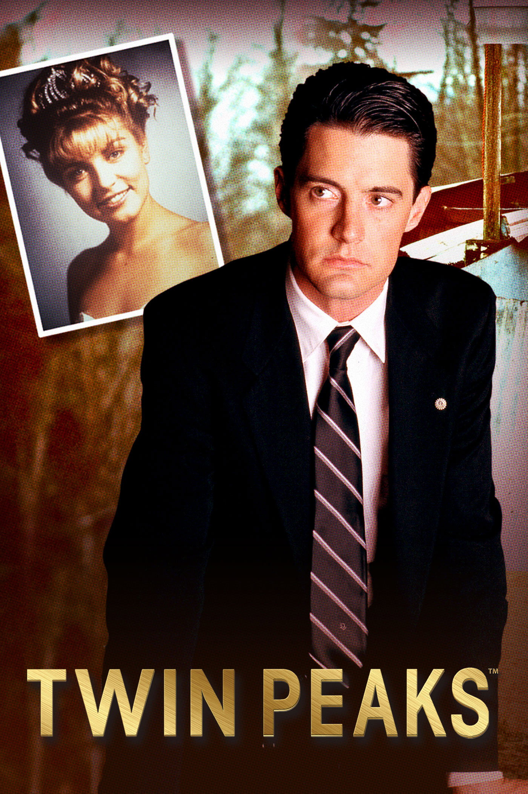

Twin Peaks is a TV series created by Mark Frost and David Lynch that is set in the small town of Twin Peaks, Washington, in the USA.

It is very hard to describe what Twin Peaks is about. It is even harder to describe what Twin Peaks *is*. All I can say for sure is that it is an experience; one that is a must-have for anyone who likes having experiences. 

Twin Peaks is focused on the murder of the local beloved teenager Laura Palmer. As the series continues, despite the narrative shifting from directly being about Laura Palmer, Laura remains the heart of it. Everything and everyone revolves around her, which includes strange, mystical, and paranormal forces of evil and good. Twin Peaks soon descends into mystical mystery, and in a very good way; you, the watcher, cannot comprehend the scale of what is occurring. But you learn to notice signs of said greater forces. But my favorite part of Twin Peaks is how the main characters choose to face these greater forces. 

Twin Peaks as a piece of media heavily focuses on mankind and what it means to be human. There are many different archetypes and types of people featuring on the show, and all of them are unique in their own way. Many different qualities are at display, including kindness, charm, hopefulness, cruelty, clumsiness, among other things.

However, me explaining this wouldn't make much of a difference, if you do not go and experience it for yourself.

Now go! Go learn the qualities of humankind! Go watch Twin Peaks!